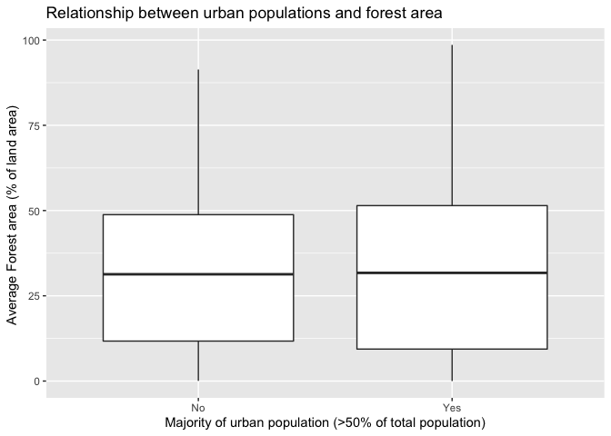
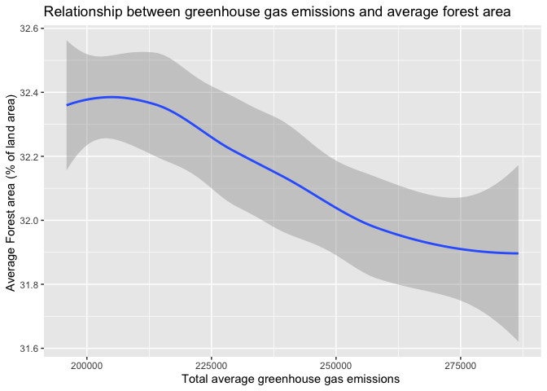
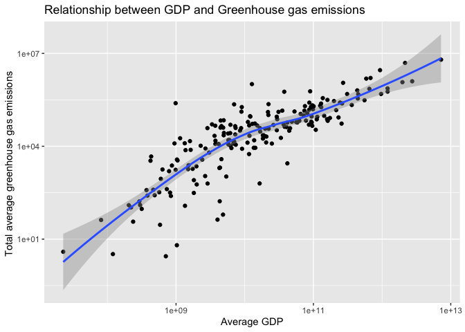

Exploring World Bank Data
================
Ojaswi Malik

## Load necessary libraries

``` r
library(tidyverse)
```

    ## ── Attaching packages ─────────────────────────────────────────────────────────────────────────────── tidyverse 1.3.0 ──

    ## ✓ ggplot2 3.3.0     ✓ purrr   0.3.4
    ## ✓ tibble  3.0.0     ✓ dplyr   0.8.5
    ## ✓ tidyr   1.0.2     ✓ stringr 1.4.0
    ## ✓ readr   1.3.1     ✓ forcats 0.5.0

    ## ── Conflicts ────────────────────────────────────────────────────────────────────────────────── tidyverse_conflicts() ──
    ## x dplyr::filter() masks stats::filter()
    ## x dplyr::lag()    masks stats::lag()

## Write a function to import the data files

``` r
import_data <- function(x) {
  #To read 1 csv file and skip the first 3 lines and reach where the column names start
  read_csv(x, skip = 3) %>%
  #To remove these columns because they will not be used in the analysis
    select(-"X65",-"Indicator Code", -"Country Code") %>%
  #To create a column for Year and put all the years in that column with respective values in the rows
    pivot_longer(
      cols = `1960`:`2019`,
      names_to = "Year",
      values_to = "Value",
      names_ptypes = list(Year = double())
    ) %>%
  #To extract indicator names from values column and make them seperate columns
    pivot_wider(
    names_from = "Indicator Name",
    values_from = "Value"
  ) %>%
  #To select and rename only those columns necessary for the analysis
    select("Country Name", "Year", "GDP (current US$)", "Total greenhouse gas emissions (kt of CO2 equivalent)", "Forest area (% of land area)" , "Urban population (% of total population)") %>%
    rename(
      country = "Country Name",
      year = "Year",
      gdp = "GDP (current US$)",
      greenhouse_emissions = "Total greenhouse gas emissions (kt of CO2 equivalent)" , 
      forest_area = "Forest area (% of land area)",
      urban_population= "Urban population (% of total population)"
      )
    
}
```

## Import the data

``` r
#To list all the csv files in the 'data_world_bank' directory in  all_data 
all_data <- list.files(path = "data_world_bank", pattern = "*.csv", full.names = TRUE)

#To apply the function import_data to each file in all_data
seperate_dfs <- lapply(all_data, import_data)

#To bind all the different countries' data together in 1 dataframe
wb_data_bind <- bind_rows(seperate_dfs)
```

## Explore the data

**Goal**: In my analysis I want to discover the effects of urban
populations on forest areas, and in turn the effect on greenhouse gas
emissions and ultimately the average GDP

### Analysis 1

**Analysis 1 Goal**: In the first analysis, I want to see if areas which
have more than 50% of urban population tend to have more or less forest
areas. For this I will categorize those countries with more than 50% of
urban population as “Yes” in majority of urban population, and those
with less than 50% as “No” in majority of urban population.

``` r
urban_majority <- wb_data_bind %>%
  group_by(country) %>%
  #To get the average value of urban population and forest area over the years, and remove any NA values
  summarise(
    avg_urban_pop = mean(urban_population, na.rm = TRUE),
    avg_forest_area = mean(forest_area, na.rm = TRUE)) %>%
  #Conditional Execution to categorise those countries with more than 50% of urban population as yes in majority, and those with less than 50% as no in majority
  mutate( Majority = if_else(avg_urban_pop > 50, "Yes", "No")) %>%
  filter(!is.na(Majority))

urban_majority %>%
  ggplot(mapping = aes(x = Majority, y =avg_forest_area)) + 
  geom_boxplot() +
  labs(
    title = "Relationship between urban populations and forest area",
    x = "Majority of urban population (>50% of total population)",
    y = "Average Forest area (% of land area) "
  )
```

    ## Warning: Removed 7 rows containing non-finite values (stat_boxplot).

<!-- -->

**Analysis 1 Observation**:From the boxplot above, there is no clear
relationship between forest areas and urban populations in all
countries. For countries with both more than and less than 50% of urban
populations, have a very similiar median of average forest area.
However, those countries with more than 50% of urban population have a
higher variance due to an outlier in terms of average forest area. This
is indicated by a longer whisker for the ‘Yes’ boxplot.

### Analysis 2

**Analysis 2 Goal**:In the next analysis, I want to discover any
underlying relationship between forest areas and greenhouse gas
emissions.

``` r
wb_data_bind %>%
  #Grouping by year to get year-wise average comparisons. this is in contrast to the analysis 1, where the data was grouped by country
  group_by(year) %>%
  summarise(
    avg_greenhouse = mean(greenhouse_emissions, na.rm = TRUE),
    avg_forest = mean(forest_area, na.rm = TRUE)
  ) %>%
  ggplot(mapping = aes(x = avg_greenhouse, y = avg_forest ) ) +
  #Using a smoothing line to visualise the plot
  geom_smooth() +
  labs(
    title = "Relationship between greenhouse gas emissions and average forest area ",
    x = "Total average greenhouse gas emissions ",
    y = "Average Forest area (% of land area) "
  )
```

    ## `geom_smooth()` using method = 'loess' and formula 'y ~ x'

    ## Warning: Removed 37 rows containing non-finite values (stat_smooth).

<!-- -->

**Analysis 2 Observation**: From the graph above, we can notice a
negative relationship between average greenhouse gas emissions and
average forest area, i.e. an increase in average greenhouse emissions is
accompanied with a decrease in the average forest area. This could be
due to more factories replacing forested land and emitting greenhouse
gases.

### Analysis 3

**Analysis 3 Goal**: In my final analysis, I want to see if there is any
relationship between the rising greenhouse emissions and the average GDP
of countries over the world.

``` r
wb_data_bind %>%
  group_by(country) %>%
  summarise(
    avg_gdp = mean(gdp, na.rm = TRUE),
    avg_greenhouse = mean(greenhouse_emissions, na.rm = TRUE)
  ) %>%
  ggplot(mapping = aes(x = avg_gdp, y = avg_greenhouse )) + 
  geom_point() +
  geom_smooth() + 
  #Scaling both the X-axis to have a closer and cleaner look to the ggplot
  scale_x_log10() + 
  scale_y_log10() + 
  labs(
    title = "Relationship between GDP and Greenhouse gas emissions",
    x = "Average GDP",
    y = "Total average greenhouse gas emissions "
  )
```

    ## `geom_smooth()` using method = 'loess' and formula 'y ~ x'

    ## Warning: Removed 21 rows containing non-finite values (stat_smooth).

    ## Warning: Removed 21 rows containing missing values (geom_point).

<!-- -->

**Analysis 3 Observation**: From the above graph, we can ascertain that
there is general positive relationship between average GDP and total
average greenhouse gas emissions. Hence, with an increase in GDP, the
greenhouse gas emissions also increase. This could be because as
countries become more developed (indicated by higher GDP), their
reliance on modern machinery which emits greenhouse gases increases.
Moreover, this result is more concentrated in the center of the
smoothing line. The edges have outliers which lead to an increase in the
width of the smoothing
    band.

## Session info

``` r
devtools::session_info()
```

    ## ─ Session info ───────────────────────────────────────────────────────────────
    ##  setting  value                       
    ##  version  R version 3.6.3 (2020-02-29)
    ##  os       macOS Catalina 10.15.4      
    ##  system   x86_64, darwin15.6.0        
    ##  ui       X11                         
    ##  language (EN)                        
    ##  collate  en_US.UTF-8                 
    ##  ctype    en_US.UTF-8                 
    ##  tz       Asia/Kolkata                
    ##  date     2020-05-04                  
    ## 
    ## ─ Packages ───────────────────────────────────────────────────────────────────
    ##  package     * version date       lib source        
    ##  assertthat    0.2.1   2019-03-21 [1] CRAN (R 3.6.0)
    ##  backports     1.1.6   2020-04-05 [1] CRAN (R 3.6.2)
    ##  broom         0.5.5   2020-02-29 [1] CRAN (R 3.6.0)
    ##  callr         3.4.3   2020-03-28 [1] CRAN (R 3.6.2)
    ##  cellranger    1.1.0   2016-07-27 [1] CRAN (R 3.6.0)
    ##  cli           2.0.2   2020-02-28 [1] CRAN (R 3.6.0)
    ##  colorspace    1.4-1   2019-03-18 [1] CRAN (R 3.6.0)
    ##  crayon        1.3.4   2017-09-16 [1] CRAN (R 3.6.0)
    ##  DBI           1.1.0   2019-12-15 [1] CRAN (R 3.6.0)
    ##  dbplyr        1.4.3   2020-04-19 [1] CRAN (R 3.6.3)
    ##  desc          1.2.0   2018-05-01 [1] CRAN (R 3.6.0)
    ##  devtools      2.3.0   2020-04-10 [1] CRAN (R 3.6.3)
    ##  digest        0.6.25  2020-02-23 [1] CRAN (R 3.6.0)
    ##  dplyr       * 0.8.5   2020-03-07 [1] CRAN (R 3.6.0)
    ##  ellipsis      0.3.0   2019-09-20 [1] CRAN (R 3.6.0)
    ##  evaluate      0.14    2019-05-28 [1] CRAN (R 3.6.0)
    ##  fansi         0.4.1   2020-01-08 [1] CRAN (R 3.6.0)
    ##  farver        2.0.3   2020-01-16 [1] CRAN (R 3.6.0)
    ##  forcats     * 0.5.0   2020-03-01 [1] CRAN (R 3.6.0)
    ##  fs            1.4.1   2020-04-04 [1] CRAN (R 3.6.2)
    ##  generics      0.0.2   2018-11-29 [1] CRAN (R 3.6.0)
    ##  ggplot2     * 3.3.0   2020-03-05 [1] CRAN (R 3.6.0)
    ##  glue          1.4.0   2020-04-03 [1] CRAN (R 3.6.2)
    ##  gtable        0.3.0   2019-03-25 [1] CRAN (R 3.6.0)
    ##  haven         2.2.0   2019-11-08 [1] CRAN (R 3.6.0)
    ##  hms           0.5.3   2020-01-08 [1] CRAN (R 3.6.0)
    ##  htmltools     0.4.0   2019-10-04 [1] CRAN (R 3.6.0)
    ##  httr          1.4.1   2019-08-05 [1] CRAN (R 3.6.0)
    ##  jsonlite      1.6.1   2020-02-02 [1] CRAN (R 3.6.0)
    ##  knitr         1.28    2020-02-06 [1] CRAN (R 3.6.0)
    ##  labeling      0.3     2014-08-23 [1] CRAN (R 3.6.0)
    ##  lattice       0.20-38 2018-11-04 [1] CRAN (R 3.6.3)
    ##  lifecycle     0.2.0   2020-03-06 [1] CRAN (R 3.6.0)
    ##  lubridate     1.7.8   2020-04-06 [1] CRAN (R 3.6.2)
    ##  magrittr      1.5     2014-11-22 [1] CRAN (R 3.6.0)
    ##  Matrix        1.2-18  2019-11-27 [1] CRAN (R 3.6.3)
    ##  memoise       1.1.0   2017-04-21 [1] CRAN (R 3.6.0)
    ##  mgcv          1.8-31  2019-11-09 [1] CRAN (R 3.6.3)
    ##  modelr        0.1.6   2020-02-22 [1] CRAN (R 3.6.0)
    ##  munsell       0.5.0   2018-06-12 [1] CRAN (R 3.6.0)
    ##  nlme          3.1-144 2020-02-06 [1] CRAN (R 3.6.3)
    ##  pillar        1.4.3   2019-12-20 [1] CRAN (R 3.6.0)
    ##  pkgbuild      1.0.6   2019-10-09 [1] CRAN (R 3.6.0)
    ##  pkgconfig     2.0.3   2019-09-22 [1] CRAN (R 3.6.0)
    ##  pkgload       1.0.2   2018-10-29 [1] CRAN (R 3.6.0)
    ##  prettyunits   1.1.1   2020-01-24 [1] CRAN (R 3.6.0)
    ##  processx      3.4.2   2020-02-09 [1] CRAN (R 3.6.0)
    ##  ps            1.3.2   2020-02-13 [1] CRAN (R 3.6.0)
    ##  purrr       * 0.3.4   2020-04-17 [1] CRAN (R 3.6.2)
    ##  R6            2.4.1   2019-11-12 [1] CRAN (R 3.6.0)
    ##  Rcpp          1.0.4.6 2020-04-09 [1] CRAN (R 3.6.3)
    ##  readr       * 1.3.1   2018-12-21 [1] CRAN (R 3.6.0)
    ##  readxl        1.3.1   2019-03-13 [1] CRAN (R 3.6.0)
    ##  remotes       2.1.1   2020-02-15 [1] CRAN (R 3.6.0)
    ##  reprex        0.3.0   2019-05-16 [1] CRAN (R 3.6.0)
    ##  rlang         0.4.5   2020-03-01 [1] CRAN (R 3.6.0)
    ##  rmarkdown     2.1     2020-01-20 [1] CRAN (R 3.6.0)
    ##  rprojroot     1.3-2   2018-01-03 [1] CRAN (R 3.6.0)
    ##  rstudioapi    0.11    2020-02-07 [1] CRAN (R 3.6.0)
    ##  rvest         0.3.5   2019-11-08 [1] CRAN (R 3.6.0)
    ##  scales        1.1.0   2019-11-18 [1] CRAN (R 3.6.0)
    ##  sessioninfo   1.1.1   2018-11-05 [1] CRAN (R 3.6.0)
    ##  stringi       1.4.6   2020-02-17 [1] CRAN (R 3.6.0)
    ##  stringr     * 1.4.0   2019-02-10 [1] CRAN (R 3.6.0)
    ##  testthat      2.3.2   2020-03-02 [1] CRAN (R 3.6.0)
    ##  tibble      * 3.0.0   2020-03-30 [1] CRAN (R 3.6.2)
    ##  tidyr       * 1.0.2   2020-01-24 [1] CRAN (R 3.6.0)
    ##  tidyselect    1.0.0   2020-01-27 [1] CRAN (R 3.6.0)
    ##  tidyverse   * 1.3.0   2019-11-21 [1] CRAN (R 3.6.0)
    ##  usethis       1.6.0   2020-04-09 [1] CRAN (R 3.6.3)
    ##  vctrs         0.2.4   2020-03-10 [1] CRAN (R 3.6.0)
    ##  withr         2.1.2   2018-03-15 [1] CRAN (R 3.6.0)
    ##  xfun          0.13    2020-04-13 [1] CRAN (R 3.6.2)
    ##  xml2          1.3.1   2020-04-09 [1] CRAN (R 3.6.2)
    ##  yaml          2.2.1   2020-02-01 [1] CRAN (R 3.6.0)
    ## 
    ## [1] /Library/Frameworks/R.framework/Versions/3.6/Resources/library
